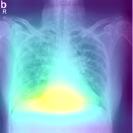
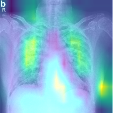

"# covid-19-detector"

# ATTENTION

**Do NOT use any result of this repo for scientific purposes without medical assistance**

# Pre-requisites

We assume you have an GPU available and python 3.6+ installed. Make sure you have installed all the correct drivers for gpu training. Check out ```https://www.tensorflow.org/install/gpu``` for information about GPU setup.

Assuming you're ok, run ```pip install -r requirements.txt``` to install all necessary packages.

# Training

Set the following options to train:

* ```-p```: Path to the dataset (dataset/)
* ```-g```: If use or not gpu in case it is possible. (Default = True)
* ```--network```: Base network to use. Supports vgg16, vgg19, resnet50 and resnet152 (Default = resnet50)
* ```--hf```: Augment with horizontal flips in training. (Default=True)
* ```--vf```: Augment with vertical flips in training. (Default=True)
* ```--rot```: Augment with 90 degree rotations in training. (Default=True)
* ```--bn```: If use or not batch normalization. Available only for both vgg models
* ```--num_epochs```: Number of epochs. (Default = 100)
* ```--config_filename```: Name of txt file that stores all the metadata related to the training (to be used when testing)
* ```--input_weight_path```: Input path for weights for classifier model
* ```--mn```: Name of the model

Example of training command line:

```python train_cnn.py -p dataset/ -g True --network vgg19 --mn vgg19_1```

# Predicting

Set the following options to predict:

* ```-w```: Path to the weights file (hdf5 or h5)
* ```-c```: Path to the config file
* ```-p```: Path to the folder containing images to be classified
* ```-g```: Use GPU or not (Default = True)


# Pattern Visualization

Set the following options to run the vis script:

* ```-p```: Path to the image
* ```-w```: Path to the weights file (hdf5 or h5)
* ```-c```: Path to the config file
* ```-g```: Use GPU or not (Default = True)

## Grad-CAM



## Occlusion Sensitivity



# Server

To run the server just enter the following line on cmd:

```python server.py -m path/to/model/weights/file```

The weights file were generated after training

After, to make an http request run request.py:

```python request.py -p path/to/folder/containing/images/to/be/classified```

# Results

All the models were run on a GPU RTX 2080 6GB. Each epoch took ~50s

* **VGG19**: ~73% accuracy after 10 epochs

# Credits

* Many thank to **Società Italiana di Radiologia Medica e Interventistica** for providing many images on https://www.sirm.org/category/senza-categoria/covid-19/
* Many thanks to https://www.medicalimages.com for providing some CT images of normal lungs
* Many thanks to **Joseph Paul Cohen** who makes part of the dataset available on https://github.com/ieee8023/covid-chestxray-dataset
* Many thanks to Adrian **Rosebrock** for providing some interesting code (https://github.com/jrosebr1)